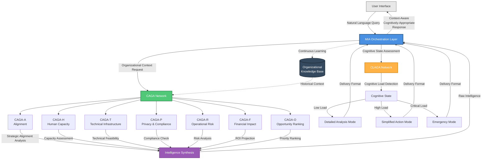

# MIA Orchestration Flow

## Overview
This diagram illustrates how MIA (Multifactorial Intelligence Alignment) serves as the orchestration layer between users and the organizational intelligence system, coordinating CAGAs and CLAGAs to deliver context-aware, cognitively-appropriate responses.

## Diagram

## Key Components

### MIA Orchestration Layer
**Purpose:** Coordinates all intelligence generation and delivery  
**Functions:**
- Receives and interprets user queries
- Activates appropriate CAGAs based on query context
- Assesses cognitive state via CLAGAs
- Synthesizes intelligence from multiple agents
- Formats delivery based on cognitive capacity
- Learns from interactions to improve future responses

### CAGA Network (7 Agents)
**Purpose:** Generate comprehensive organizational intelligence  
**Agents:**
1. **CAGA-A (Alignment)** - Strategic goal alignment
2. **CAGA-H (Human Capacity)** - Human impact assessment
3. **CAGA-T (Technical)** - Infrastructure feasibility
4. **CAGA-P (Privacy/Compliance)** - Regulatory validation
5. **CAGA-R (Risk)** - Operational risk analysis
6. **CAGA-F (Financial)** - ROI and cost projection
7. **CAGA-O (Opportunity)** - Multi-factor ranking

### CLAGA Network
**Purpose:** Adapt delivery to human cognitive capacity  
**States:**
- **Low Load** → Detailed analysis, multiple scenarios, exploratory
- **High Load** → Simplified actions, clear next steps, defer non-urgent
- **Critical Load** → Emergency mode, single recommendation, minimal context

### Intelligence Synthesis
**Purpose:** Combine multi-dimensional analysis into coherent recommendations  
**Process:**
- Aggregates insights from all active CAGAs
- Identifies conflicts or dependencies
- Resolves tensions (e.g., alignment vs. cost)
- Produces unified recommendation set

### Organizational Knowledge Base
**Purpose:** Persistent organizational context  
**Contains:**
- Workflow maps
- Decision architectures
- Historical implementations
- Constraint profiles
- Evolution patterns

## Flow Description

### Step 1: User Query
User submits natural language request through interface

### Step 2: MIA Activation
MIA interprets query and determines:
- Which CAGAs to activate
- What organizational context is needed
- User's cognitive state assessment needed

### Step 3: Parallel Processing
**CAGAs:** Generate domain-specific intelligence  
**CLAGAs:** Assess user's current cognitive capacity

### Step 4: Intelligence Synthesis
All CAGA outputs are synthesized into coherent recommendations

### Step 5: Cognitive Adaptation
CLAGA determines appropriate delivery format based on load state

### Step 6: Response Delivery
MIA delivers context-aware, cognitively-appropriate response to user

### Step 7: Continuous Learning
Interaction is stored in organizational knowledge base for future improvement

## Usage Examples

### Example 1: AI Implementation Decision
**User Query:** "Should we implement AI-powered ticket categorization?"

**MIA Process:**
1. Activates all 7 CAGAs
2. CAGA-A checks alignment with customer service goals
3. CAGA-H assesses support team capacity impact
4. CAGA-T validates technical infrastructure readiness
5. CAGA-P checks for compliance requirements
6. CAGA-R identifies implementation risks
7. CAGA-F projects ROI and costs
8. CAGA-O ranks against other opportunities
9. CLAGA detects user is in detailed analysis mode (low cognitive load)
10. MIA delivers comprehensive recommendation with full reasoning

**Response Format:** Detailed analysis with scenarios and tradeoffs

---

### Example 2: Emergency Decision
**User Query:** "Customer onboarding is broken, what do we do NOW?"

**MIA Process:**
1. Activates CAGA-R (risk) and CAGA-H (human capacity) primarily
2. CLAGA detects critical cognitive load (emergency situation)
3. MIA synthesizes into single clear action
4. Defers detailed analysis until cognitive capacity improves

**Response Format:** "🚨 Pause new customer onboarding immediately. Notify existing customers of delay. [Full analysis available when ready]"

---

## Technical Implementation Notes

### MIA Architecture
- Conversational AI interface (LLM-based)
- Agent coordination logic
- Context management system
- Response formatting engine

### CAGA Integration
- Parallel execution when possible
- Sequential execution when dependencies exist
- Timeout handling for slow agents
- Fallback logic if agent unavailable

### CLAGA Integration
- Real-time cognitive load detection via:
  - Interaction pace
  - Query complexity
  - Click patterns
  - Time of day/week
  - Historical stress indicators
- Dynamic response formatting
- Progressive disclosure logic

### Knowledge Base
- Graph database for organizational structure
- Vector embeddings for semantic search
- Time-series data for evolution tracking
- Access control for sensitive information

## Design Principles

1. **Context-Aware:** Every response considers full organizational context
2. **Multi-Dimensional:** No single-factor analysis; all 7 CAGAs contribute
3. **Cognitively Adaptive:** Delivery matches human capacity in real-time
4. **Continuously Learning:** Every interaction improves future intelligence
5. **Transparent:** Users can see why recommendations were made
6. **Human-Controlled:** MIA recommends, humans decide

## File Information
- **Created:** December 2025
- **Version:** 2.0
- **Part of:** OAI³ Framework Architecture Documentation
- **Related Diagrams:** 
  - CAGA Network Architecture
  - CLAGA Adaptation Flow
  - Complete System Integration