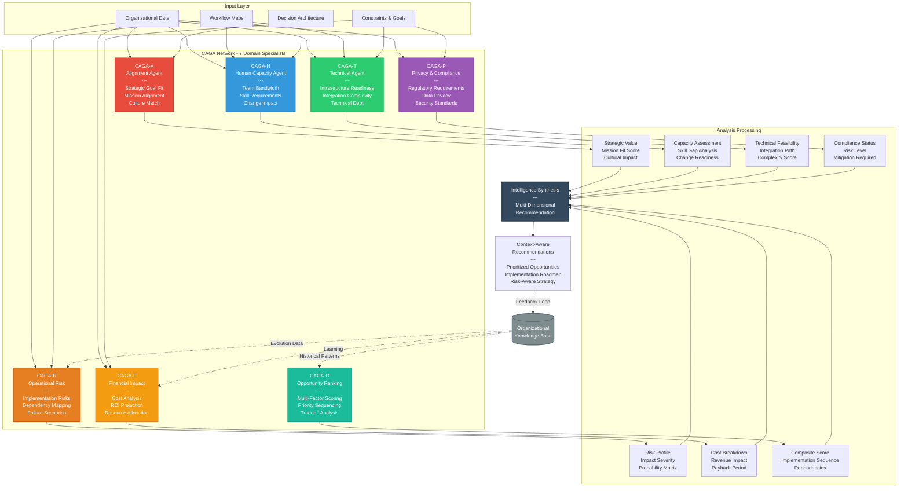

# CAGA Network Architecture

## Overview
This diagram details the Context-Aware Growth Agents (CAGAs) - seven specialized reasoning engines that analyze organizational context across different domains to generate comprehensive, multi-dimensional intelligence.

## Diagram



## CAGA Specifications

### CAGA-A: Alignment Agent
**Domain:** Strategic Alignment & Mission Fit

**Analyzes:**
- Does this opportunity align with stated organizational goals?
- How does this serve the company's mission?
- Does this fit the organizational culture and values?
- Will this move us closer to our strategic objectives?

**Outputs:**
- Strategic Value Score (0-100)
- Mission Alignment Assessment
- Cultural Fit Analysis
- Goal Contribution Mapping

**Example Analysis:**
```
Query: "Implement AI-powered customer sentiment analysis"

CAGA-A Output:
- Strategic Value: 85/100
- Alignment: HIGH - Directly supports customer experience goal
- Mission Fit: Company mission is "customer-first service"
- Culture Match: Team values data-driven decisions
- Recommendation: STRONG ALIGN - Proceed with confidence
```

---

### CAGA-H: Human Capacity Agent
**Domain:** People & Change Management

**Analyzes:**
- Does the team have bandwidth for this implementation?
- What skills are required vs. what exists?
- How will this impact team workload and morale?
- What change management is needed?

**Outputs:**
- Capacity Assessment (Available/Constrained/Overloaded)
- Skill Gap Analysis
- Change Impact Score
- Adoption Readiness Level

**Example Analysis:**
```
Query: "Implement AI-powered customer sentiment analysis"

CAGA-H Output:
- Capacity: CONSTRAINED - Team at 85% utilization
- Skill Gap: Medium - Need data analyst training
- Change Impact: Moderate - Affects 15 people
- Readiness: 60% - Some resistance expected
- Recommendation: Requires 2-month ramp-up + training
```

---

### CAGA-T: Technical Infrastructure Agent
**Domain:** Technology & Systems

**Analyzes:**
- Is our technical infrastructure ready for this?
- What integrations are required?
- What's the technical complexity?
- Do we have the necessary technical foundation?

**Outputs:**
- Infrastructure Readiness Score
- Integration Complexity Rating
- Technical Debt Assessment
- Implementation Path

**Example Analysis:**
```
Query: "Implement AI-powered customer sentiment analysis"

CAGA-T Output:
- Readiness: 70% - CRM integration exists, need API access
- Complexity: MEDIUM - 3 integration points
- Technical Debt: Low impact - isolated implementation
- Path: Use existing customer feedback pipeline
- Timeline: 6-8 weeks for technical setup
- Recommendation: FEASIBLE with existing infrastructure
```

---

### CAGA-P: Privacy & Compliance Agent
**Domain:** Regulatory & Security

**Analyzes:**
- Are there regulatory requirements for this?
- What privacy concerns exist?
- What security standards must be met?
- What compliance documentation is needed?

**Outputs:**
- Compliance Status (Compliant/Needs Review/High Risk)
- Privacy Risk Assessment
- Required Certifications
- Mitigation Requirements

**Example Analysis:**
```
Query: "Implement AI-powered customer sentiment analysis"

CAGA-P Output:
- Compliance: NEEDS REVIEW - Customer data involved
- Privacy Risk: MEDIUM - PII in feedback text
- Requirements: GDPR consent, data minimization
- Certifications: None required (not healthcare/finance)
- Mitigation: Anonymize before analysis, explicit consent
- Recommendation: PROCEED with privacy safeguards
```

---

### CAGA-R: Operational Risk Agent
**Domain:** Risk & Dependencies

**Analyzes:**
- What could go wrong?
- What dependencies exist?
- What's the blast radius if this fails?
- What ripple effects will this create?

**Outputs:**
- Risk Profile (Low/Medium/High/Critical)
- Dependency Map
- Failure Scenario Analysis
- Mitigation Strategies

**Example Analysis:**
```
Query: "Implement AI-powered customer sentiment analysis"

CAGA-R Output:
- Risk Level: MEDIUM
- Key Risk: Model accuracy affects customer experience
- Dependencies: Requires CRM data quality
- Failure Scenario: Misclassified sentiments → wrong responses
- Blast Radius: Customer-facing, but containable
- Mitigation: Human review for first 30 days, accuracy threshold
- Recommendation: PROCEED with safety gates
```

---

### CAGA-F: Financial Impact Agent
**Domain:** Cost & ROI

**Analyzes:**
- What's the total cost of this?
- What's the expected return?
- How long until break-even?
- What's the opportunity cost?

**Outputs:**
- Cost Breakdown
- ROI Projection
- Payback Period
- Budget Fit Assessment

**Example Analysis:**
```
Query: "Implement AI-powered customer sentiment analysis"

CAGA-F Output:
- Total Cost: $12,500 (setup) + $400/month (platform)
- Time Investment: 120 hours (team time)
- Expected Return: 15% faster issue resolution = $3,200/month value
- Payback Period: 4.5 months
- Budget Fit: Within Q2 innovation budget
- Recommendation: STRONG ROI - prioritize for Q2
```

---

### CAGA-O: Opportunity Ranking Agent
**Domain:** Synthesis & Prioritization

**Analyzes:**
- Given all factors, how does this rank?
- What's the optimal implementation sequence?
- What tradeoffs exist?
- How does this compare to alternatives?

**Inputs:** All other CAGA outputs

**Outputs:**
- Composite Score (weighted multi-factor)
- Priority Ranking
- Implementation Sequence
- Tradeoff Analysis

**Example Analysis:**
```
Query: "Implement AI-powered customer sentiment analysis"

CAGA-O Output (Synthesizing all CAGAs):
- Composite Score: 78/100
- Ranking: #3 of 12 active opportunities
- Recommended Sequence: After CRM upgrade (Q1), before chatbot (Q3)
- Tradeoffs:
  ✓ High strategic value (CAGA-A: 85)
  ✓ Strong ROI (CAGA-F: 4.5 month payback)
  ⚠ Medium capacity constraint (CAGA-H: 60% readiness)
  ⚠ Privacy review needed (CAGA-P: requires safeguards)
- Recommendation: PRIORITIZE for Q2 with 2-month ramp-up
```

## How CAGAs Work Together

### Parallel Processing
When possible, CAGAs analyze simultaneously:
- CAGA-A, CAGA-H, CAGA-T, CAGA-P, CAGA-R, CAGA-F → Independent analysis
- CAGA-O waits for all others to complete → Synthesizes results

### Sequential Processing
When dependencies exist:
- CAGA-T must complete before CAGA-F (costs depend on technical path)
- CAGA-A through CAGA-F must complete before CAGA-O (synthesis requires all inputs)

### Conflict Resolution
When CAGAs disagree:
- High strategic value (CAGA-A) but high risk (CAGA-R) → CAGA-O weighs based on org risk tolerance
- Strong ROI (CAGA-F) but low capacity (CAGA-H) → CAGA-O sequences for when capacity improves
- Technical feasibility (CAGA-T) conflicts with compliance (CAGA-P) → CAGA-O recommends architecture changes

## Intelligence Synthesis Process

### Step 1: Individual Analysis
Each CAGA performs domain-specific analysis independently

### Step 2: Cross-CAGA Validation
- Check for logical inconsistencies
- Identify missing information
- Flag conflicts for resolution

### Step 3: Weighted Scoring
CAGA-O applies organizational weights:
```
Default Weights (adjustable per organization):
- Alignment (CAGA-A): 20%
- Human Capacity (CAGA-H): 15%
- Technical (CAGA-T): 15%
- Compliance (CAGA-P): 10%
- Risk (CAGA-R): 15%
- Financial (CAGA-F): 15%
- Context (organization-specific): 10%
```

### Step 4: Recommendation Generation
- Composite score calculated
- Priority ranking determined
- Implementation sequence optimized
- Tradeoffs identified and explained

### Step 5: Confidence Assessment
Each recommendation includes confidence level:
- **High Confidence:** All CAGAs agree, clear data
- **Medium Confidence:** Some conflicts, resolved via org preferences
- **Low Confidence:** Missing data, significant conflicts, recommend further analysis

## Continuous Learning

### Pattern Recognition
CAGAs improve through:
- Implementation outcomes tracked
- Prediction accuracy measured
- Organizational patterns identified
- Model weights adjusted

### Knowledge Base Integration
- Historical decisions inform future analysis
- Successful patterns reinforced
- Failed implementations analyzed for lessons
- Organizational evolution tracked

### Customization
Each organization's CAGA network adapts to:
- Industry-specific factors
- Company culture and values
- Risk tolerance profile
- Decision-making patterns

## Technical Implementation Notes

### CAGA Architecture
Each CAGA is implemented as:
- Specialized reasoning module
- Domain-specific data model
- Analysis algorithms (deterministic + ML-based)
- Confidence scoring logic

### Data Requirements
CAGAs require access to:
- Organizational structure data
- Workflow documentation
- Historical decision data
- Financial information (controlled access)
- Compliance/regulatory frameworks
- Technical architecture specs

### Performance Optimization
- Parallel execution where possible
- Caching of frequently-used analyses
- Progressive disclosure (start with high-priority CAGAs)
- Timeout handling for slow analyses

## Design Principles

1. **Domain Specialization:** Each CAGA focuses on one dimension of analysis
2. **Independent Analysis:** CAGAs don't influence each other during analysis
3. **Transparent Reasoning:** All CAGA logic is explainable
4. **Organizational Context:** Every analysis is specific to this organization
5. **Continuous Improvement:** CAGAs learn from outcomes
6. **Human-Interpretable:** Outputs are understandable to non-technical stakeholders

## File Information
- **Created:** December 2025
- **Version:** 2.0
- **Part of:** OAI³ Framework Architecture Documentation
- **Related Diagrams:**
  - MIA Orchestration Flow
  - CLAGA Adaptation Flow
  - Complete System Integration