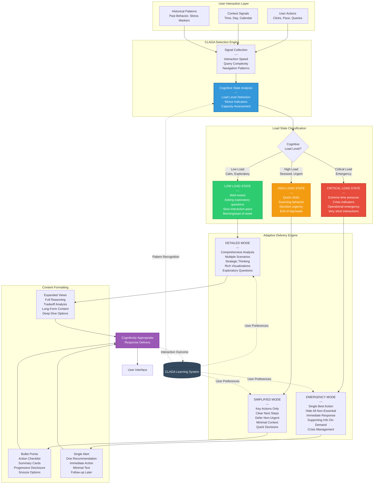

# CLAGA Adaptation Flow

## Overview
This diagram illustrates how Cognitive Load Aware Growth Agents (CLAGAs) detect human cognitive state in real-time and adapt information delivery to prevent overwhelm and ensure actionable intelligence.

## Diagram



## CLAGA Detection Mechanisms

### Signal Collection Layer

#### 1. Interaction Speed Signals
**What CLAGAs Monitor:**
- Time between clicks
- Scroll speed
- Query entry pace
- Page dwell time

**Interpretation:**
- **Slow, deliberate** → Low cognitive load (exploring, learning)
- **Fast, jumping** → High cognitive load (stressed, scanning)
- **Very rapid, erratic** → Critical load (crisis mode)

**Example:**
```
Low Load Pattern:
- User opens dashboard at 9am
- Spends 3 minutes reading each section
- Types queries slowly, pauses to think
→ CLAGA: "User is in analytical mode, show detailed insights"

High Load Pattern:
- User opens dashboard at 6pm Friday
- Quick clicks through multiple pages
- Scans headlines, doesn't read details
→ CLAGA: "User is time-pressured, show action items only"
```

---

#### 2. Query Complexity Signals
**What CLAGAs Monitor:**
- Question type (exploratory vs. directive)
- Query length and specificity
- Follow-up question patterns

**Interpretation:**
- **"How does X work?"** → Low load, wants to learn
- **"What should I do about X?"** → High load, needs decision
- **"Fix X NOW"** → Critical load, emergency

**Example:**
```
Low Load Query:
"Can you explain how the CAGA network evaluates alignment?"
→ CLAGA: Detailed explanation mode

High Load Query:
"Which AI opportunity should we implement first?"
→ CLAGA: Direct recommendation with brief rationale

Critical Load Query:
"Customer pipeline is broken, what NOW?"
→ CLAGA: Single action, defer analysis
```

---

#### 3. Navigation Pattern Signals
**What CLAGAs Monitor:**
- Page sequence
- Back-button usage
- Search vs. browse behavior
- Abandoned actions

**Interpretation:**
- **Linear progression** → Low load, following logical path
- **Jumping between sections** → High load, seeking specific info
- **Repeated back-clicks** → Very high load, can't find what's needed

---

#### 4. Contextual Signals
**What CLAGAs Monitor:**
- Time of day
- Day of week
- Calendar events (if integrated)
- Recent system alerts

**Interpretation:**
- **Monday 9am** → Generally lower load
- **Friday 5pm** → Generally higher load
- **After system alert** → Elevated load
- **During scheduled "focus time"** → Lower load

---

#### 5. Historical Pattern Signals
**What CLAGAs Learn:**
- User's typical interaction patterns
- Stress indicators specific to this user
- Preferred information density
- Response to different formats

**Personalization:**
```
User A Profile:
- Prefers detailed analysis even under pressure
- Rarely uses simplified mode
→ CLAGA: Higher threshold for simplification

User B Profile:
- Gets overwhelmed by too much information
- Frequently requests summaries
→ CLAGA: Lower threshold for simplification
```

## Cognitive Load State Definitions

### LOW LOAD STATE
**Characteristics:**
- User is calm, exploratory
- Has time for strategic thinking
- Asking "how" and "why" questions
- Slow, deliberate interactions

**User Experience in This State:**
- Expanded detail views available
- Rich visualizations shown
- Multiple scenarios presented
- Tradeoff analyses displayed
- "Dig deeper" options offered
- Educational content included

**UI Adaptations:**
```
Dashboard: Full intelligence overview
Recommendations: Complete reasoning shown
Visualizations: Detailed graphs, heat maps
Options: All alternatives presented
Documentation: Comprehensive explanations
```

**Example Scenario:**
```
Situation: User opens CosentriQ Monday morning, reviews weekly intelligence report

CLAGA Detection:
- Time: 9:00 AM Monday (low-stress time)
- Pace: Slow scrolling, 2-3 min per section
- Queries: "Explain the rationale behind this ranking"
→ Load State: LOW

Delivery Mode: DETAILED
- Show full CAGA analysis for each opportunity
- Display tradeoff comparisons
- Include scenario modeling options
- Offer deep-dive documentation
- Present educational content about methodology
```

---

### HIGH LOAD STATE
**Characteristics:**
- User is time-pressured
- Needs decisions, not exploration
- Quick scanning behavior
- End of day/week timing

**User Experience in This State:**
- Simplified action-focused views
- Clear "next steps" highlighted
- Non-urgent items hidden or deferrable
- Summary cards instead of full analysis
- "Snooze until tomorrow" options

**UI Adaptations:**
```
Dashboard: Action items only
Recommendations: Top 3 with brief rationale
Visualizations: Simplified charts, key metrics
Options: Pre-filtered to best choices
Documentation: Executive summaries
```

**Example Scenario:**
```
Situation: User opens CosentriQ Friday afternoon, needs to make decision before weekend

CLAGA Detection:
- Time: 4:30 PM Friday (high-stress time)
- Pace: Rapid clicking, scanning headlines
- Queries: "What's the top priority right now?"
→ Load State: HIGH

Delivery Mode: SIMPLIFIED
- Show top 3 recommendations only
- Brief 2-sentence rationale for each
- Clear "Approve" or "Defer" buttons
- Hide detailed analysis (available on-demand)
- Offer "Review Monday" option for non-urgent items
```

---

### CRITICAL LOAD STATE
**Characteristics:**
- User in crisis or emergency
- Extreme time pressure
- Operational incident in progress
- Very short, urgent queries

**User Experience in This State:**
- Single best recommendation
- Minimal explanation
- Immediate action focus
- All supporting info hidden (available on-demand)
- Follow-up deferred automatically

**UI Adaptations:**
```
Dashboard: Emergency alert mode
Recommendations: ONE clear action
Visualizations: None (unless critical)
Options: Single best path
Documentation: None shown (link provided)
```

**Example Scenario:**
```
Situation: Critical system failure, customer-facing workflow broken

CLAGA Detection:
- Context: System alert triggered 5 minutes ago
- Pace: User lands on page immediately, no browsing
- Query: "Production onboarding is DOWN, what do I do?"
→ Load State: CRITICAL

Delivery Mode: EMERGENCY
- Single recommendation: "Pause new customer onboarding immediately"
- One supporting action: "Notify existing customers of delay"
- Defer all analysis: "Full incident analysis available after resolution"
- Suppress all non-essential notifications
- Provide simple "Mark Resolved" button
```

## Adaptive Content Examples

### Same Intelligence, Different Delivery

**Scenario:** AI implementation recommendation for ticket categorization

---

**LOW LOAD DELIVERY:**
```
┌─────────────────────────────────────────────────────────┐
│ AI-Powered Ticket Categorization - Full Analysis       │
├─────────────────────────────────────────────────────────┤
│                                                         │
│ Recommendation: IMPLEMENT (Priority #3)                │
│ Composite Score: 78/100                                │
│                                                         │
│ Strategic Alignment (CAGA-A): 85/100                   │
│ → Directly supports customer experience goals          │
│ → Aligns with data-driven culture                      │
│ → Strengthens competitive positioning                  │
│                                                         │
│ Human Capacity (CAGA-H): 60/100                        │
│ → Team currently at 85% utilization                    │
│ → Requires 2-week training ramp-up                     │
│ → Medium change management needed                      │
│                                                         │
│ Technical Feasibility (CAGA-T): 70/100                 │
│ → CRM integration available                            │
│ → Moderate complexity (3 integration points)           │
│ → 6-8 week technical timeline                          │
│                                                         │
│ [View Full Analysis] [Compare Alternatives]            │
│ [See Implementation Roadmap] [Risk Assessment]         │
└─────────────────────────────────────────────────────────┘
```

---

**HIGH LOAD DELIVERY:**
```
┌─────────────────────────────────────────────────────────┐
│ ⭐ Recommended: AI Ticket Categorization                │
├─────────────────────────────────────────────────────────┤
│                                                         │
│ Why: Strong strategic fit, positive ROI                │
│                                                         │
│ When: Q2 implementation (after team training)          │
│                                                         │
│ Action needed:                                          │
│ ☐ Approve for Q2 budget                                │
│ ☐ Schedule team training (2 weeks)                     │
│ ☐ Review compliance requirements                       │
│                                                         │
│ [Approve] [Defer to Monday] [Details ↓]                │
└─────────────────────────────────────────────────────────┘
```

---

**CRITICAL LOAD DELIVERY:**
```
┌─────────────────────────────────────────────────────────┐
│ 🚨 ACTION REQUIRED                                      │
├─────────────────────────────────────────────────────────┤
│                                                         │
│ RECOMMENDED: Approve AI ticket categorization for Q2   │
│                                                         │
│ [Approve Now] [Review Later]                           │
│                                                         │
│ Full analysis available after resolution ↓             │
└─────────────────────────────────────────────────────────┘
```

## CLAGA Learning System

### Continuous Improvement

**What CLAGAs Learn:**
1. **User-specific patterns**
   - When is this user typically stressed?
   - What triggers cognitive load for them?
   - What information density do they prefer?

2. **Outcome tracking**
   - Did simplified mode help or frustrate?
   - Was emergency mode appropriate?
   - Did user override CLAGA suggestions?

3. **Preference mapping**
   - Some users prefer detail even under pressure
   - Some users prefer brevity always
   - Context-specific preferences

### Feedback Mechanisms

**Explicit Feedback:**
- "Show more detail" button → User wants richer content
- "Too much information" button → User wants simplification
- Snooze/Defer actions → Confirms high cognitive load

**Implicit Feedback:**
- User expands collapsed sections → Wants more detail
- User quickly dismisses modals → Wants less interruption
- User repeatedly clicks "Summary" → Prefers simplified

### Personalization Over Time

```
User Journey Example:

Week 1:
- CLAGA uses default thresholds
- Learns user prefers more detail than average
- Adjusts LOW/HIGH load boundaries

Month 1:
- CLAGA identifies Friday afternoons = consistently high load
- Automatically simplifies Friday 3pm+ content
- User approves 90% of simplified suggestions

Month 3:
- CLAGA recognizes user stress patterns
- Pre-emptively simplifies during known high-stress periods
- User reports feeling "less overwhelmed"
- CLAGA model refined to user preferences
```

## Technical Implementation

### Detection Algorithm
```
Cognitive Load Score = weighted_sum(
    interaction_speed_score * 0.3,
    query_complexity_score * 0.2,
    navigation_pattern_score * 0.2,
    contextual_score * 0.15,
    historical_pattern_score * 0.15
)

if load_score < 0.3: state = LOW_LOAD
elif load_score < 0.7: state = HIGH_LOAD
else: state = CRITICAL_LOAD
```

### Threshold Customization
Each user has personalized thresholds:
```
User A (prefers detail):
- LOW → HIGH threshold: 0.5 (higher than default)
- HIGH → CRITICAL threshold: 0.8

User B (easily overwhelmed):
- LOW → HIGH threshold: 0.2 (lower than default)
- HIGH → CRITICAL threshold: 0.6
```

### Response Time Optimization
- CLAGA detection runs in <50ms
- Does not block content delivery
- Can adjust mid-session if load state changes

## Design Principles

1. **Non-Intrusive:** Detection happens passively, no explicit user input required
2. **Reversible:** Users can always request more/less detail
3. **Personalized:** Adapts to individual preferences and patterns
4. **Context-Aware:** Considers time, situation, historical patterns
5. **Continuously Learning:** Improves accuracy over time
6. **Respectful:** Assumes users are capable, just time-constrained

## Research Basis

This approach is grounded in:
- **Cognitive Load Theory** (Sweller, 1988)
- **Information Overload Research** (Eppler & Mengis, 2004)
- **Adaptive Interfaces** (Jameson, 2008)
- **Real-time Stress Detection** (Hernandez et al., 2011)

## File Information
- **Created:** December 2025
- **Version:** 2.0
- **Part of:** OAI³ Framework Architecture Documentation
- **Related Diagrams:**
  - MIA Orchestration Flow
  - CAGA Network Architecture
  - Complete System Integration