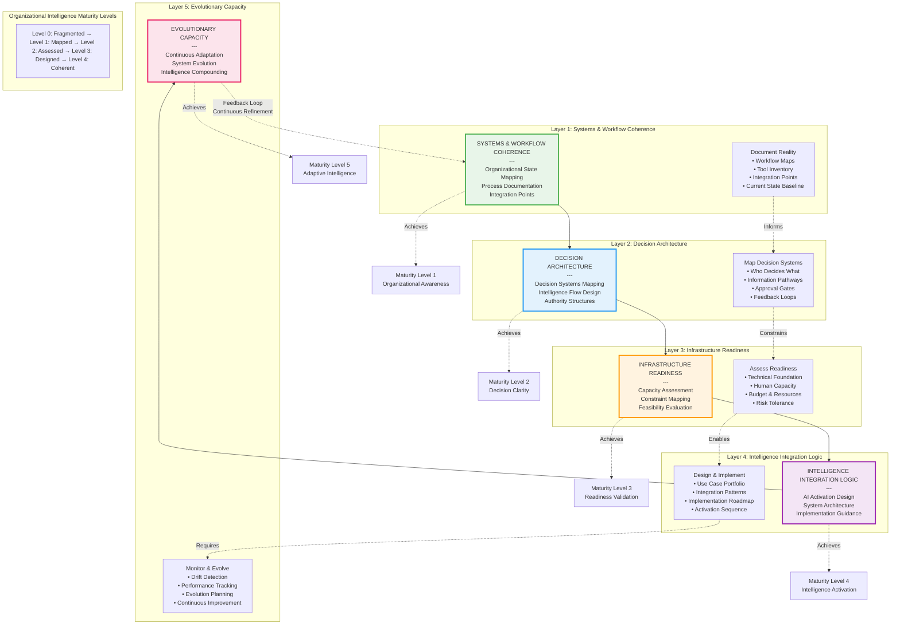

# OAI³ Implementation Stack

## Overview
This diagram illustrates the five foundational layers of OAI³ (Organizational Ambient Integrated Intelligence) - the framework that transforms organizations from fragmented systems into coherent, adaptive intelligence infrastructures.

## Diagram



## Layer Specifications

### Layer 1: Systems & Workflow Coherence
**"Map how the organization actually works"**

#### Purpose
Establish organizational awareness by documenting the current state—not the idealized state, but reality.

#### Key Questions
- How does work actually get done?
- What tools and systems exist?
- Where does information live?
- How are processes currently executed?

#### Deliverables
1. **Workflow Maps**
   - End-to-end process documentation
   - Handoff points between teams
   - Decision points and bottlenecks
   - Tool usage across workflows

2. **Tool Inventory**
   - All software and systems in use
   - Integration status (connected/siloed)
   - User adoption levels
   - Redundancies and gaps

3. **Integration Point Mapping**
   - Data flows between systems
   - API connections
   - Manual handoffs
   - Information silos

4. **Current State Baseline**
   - Performance metrics
   - Efficiency measurements
   - Error rates
   - Time/cost data

#### Maturity Achievement: Level 1 - Organizational Awareness
**What this means:** The organization can see itself clearly. Leaders understand how work flows, where bottlenecks exist, and what tools are actually being used.

**Without Layer 1:** You're flying blind. AI implementations will fail because you don't understand the system you're trying to improve.

---

### Layer 2: Decision Architecture
**"Map how decisions are made and who makes them"**

#### Purpose
Create clarity around decision-making systems, information flows, and authority structures.

#### Key Questions
- Who decides what in this organization?
- What information is needed for each decision?
- How do decisions cascade through the organization?
- Where are decision bottlenecks?

#### Deliverables
1. **Decision Authority Mapping**
   - Decision ownership by type
   - Approval hierarchies
   - Delegation patterns
   - Escalation pathways

2. **Information Pathways**
   - What data informs which decisions
   - Signal sources (internal/external)
   - Intelligence flows
   - Reporting structures

3. **Approval Gates**
   - Required checkpoints
   - Review processes
   - Governance mechanisms
   - Compliance touchpoints

4. **Feedback Loops**
   - How outcomes inform future decisions
   - Learning mechanisms
   - Course-correction processes
   - Knowledge capture

#### Maturity Achievement: Level 2 - Decision Clarity
**What this means:** Everyone knows who decides what, with what information, and how decisions flow through the organization.

**Without Layer 2:** AI recommendations sit in a vacuum. You don't know who should approve them, what authority they need, or how to implement them.

---

### Layer 3: Infrastructure Readiness
**"Assess if the organization can absorb AI"**

#### Purpose
Evaluate organizational capacity to adopt intelligence—technical, human, financial, and cultural.

#### Key Questions
- Do we have the technical foundation for AI?
- Does the team have bandwidth and skills?
- Can we afford this?
- What constraints limit us?

#### Deliverables
1. **Technical Foundation Assessment**
   - Infrastructure capabilities
   - Data quality and availability
   - Integration complexity
   - Technical debt impact

2. **Human Capacity Evaluation**
   - Team bandwidth analysis
   - Skill gap assessment
   - Change readiness
   - Training requirements

3. **Budget & Resource Analysis**
   - Financial capacity
   - Time availability
   - Opportunity cost
   - ROI requirements

4. **Risk Tolerance Mapping**
   - Appetite for change
   - Compliance constraints
   - Security requirements
   - Failure tolerance

#### Maturity Achievement: Level 3 - Readiness Validation
**What this means:** The organization knows its constraints and can make informed decisions about what's feasible.

**Without Layer 3:** AI implementations will overwhelm the team, exceed budget, or fail due to technical limitations you didn't anticipate.

---

### Layer 4: Intelligence Integration Logic
**"Design how AI fits into the organization"**

#### Purpose
Create the blueprint for AI activation—where intelligence should be introduced, how systems should integrate, and what sequence makes sense.

#### Key Questions
- Where should AI be activated?
- How should AI integrate with existing systems?
- What's the right implementation sequence?
- How do we ensure coherence, not fragmentation?

#### Deliverables
1. **Use Case Portfolio**
   - Ranked AI opportunities
   - Strategic alignment scores
   - Feasibility assessments
   - Expected outcomes

2. **Integration Patterns**
   - System connection designs
   - Data flow architectures
   - API strategies
   - Workflow augmentation plans

3. **Implementation Roadmap**
   - Phased activation plan
   - Dependency sequencing
   - Resource allocation
   - Milestone definitions

4. **Activation Sequence**
   - Which implementations first
   - Build vs. buy decisions
   - Pilot strategies
   - Scale planning

#### Maturity Achievement: Level 4 - Intelligence Activation
**What this means:** AI is thoughtfully integrated into organizational workflows, enhancing rather than disrupting existing intelligence.

**Without Layer 4:** AI implementations are ad-hoc and fragmented. Tools pile up, workflows break, and the organization becomes *less* coherent, not more.

---

### Layer 5: Evolutionary Capacity
**"Ensure intelligence compounds over time"**

#### Purpose
Establish continuous monitoring, adaptation, and evolution mechanisms so organizational intelligence grows rather than degrades.

#### Key Questions
- Is our AI infrastructure still working as designed?
- How has the organization changed?
- What needs to evolve?
- Are we getting better or drifting?

#### Deliverables
1. **Drift Detection Systems**
   - Performance monitoring
   - Accuracy tracking
   - Workflow health checks
   - System coherence scoring

2. **Performance Tracking**
   - ROI measurement
   - Goal achievement tracking
   - Efficiency metrics
   - Impact assessment

3. **Evolution Planning**
   - Adaptation recommendations
   - Upgrade pathways
   - Optimization opportunities
   - Expansion strategies

4. **Continuous Improvement**
   - Learning from outcomes
   - Pattern recognition
   - Best practice capture
   - Knowledge compounding

#### Maturity Achievement: Level 5 - Adaptive Intelligence
**What this means:** The organization's intelligence infrastructure adapts automatically as the business evolves. Intelligence compounds rather than fragments.

**Without Layer 5:** AI implementations degrade over time. What worked 6 months ago breaks as workflows change. The organization falls back to chaos.

---

## How Layers Build on Each Other

### Sequential Dependencies

**Layer 1 Enables Layer 2:**
You can't map decision architecture without first understanding workflows. Decision systems are embedded in operational processes.

**Layer 2 Enables Layer 3:**
You can't assess readiness without understanding decision structures. Capacity constraints are decision-specific.

**Layer 3 Enables Layer 4:**
You can't design integration without knowing constraints. Implementation plans must respect organizational reality.

**Layer 4 Enables Layer 5:**
You can't monitor what you haven't designed. Evolution requires baseline architecture to measure against.

**Layer 5 Feeds Back to Layer 1:**
As the organization evolves, workflows change. The cycle begins again, but at a higher maturity level.

---

### The Feedback Loop

```
Initial State: Fragmented Organization (Level 0)
↓
Layer 1 Complete → Organizational Awareness (Level 1)
↓
Layer 2 Complete → Decision Clarity (Level 2)
↓
Layer 3 Complete → Readiness Validation (Level 3)
↓
Layer 4 Complete → Intelligence Activation (Level 4)
↓
Layer 5 Complete → Adaptive Intelligence (Level 5)
↓
Organization Evolves → Workflows Change
↓
Layer 5 Detects Drift → Triggers Layer 1 Refresh
↓
Cycle Repeats at Higher Maturity Level
```

---

## Organizational Intelligence Maturity Model

### Level 0: Fragmented
**Characteristics:**
- No systematic understanding of workflows
- Ad-hoc AI experimentation
- Tool sprawl without integration
- Decisions made in information vacuums

**Signs you're here:**
- "We don't know what we don't know"
- Multiple AI tools, unclear ROI
- Workflows break when people leave
- Intelligence trapped in individual heads

**Next Step:** Begin Layer 1 - Map your current state

---

### Level 1: Mapped (Layer 1 Complete)
**Characteristics:**
- Workflows documented
- Tools inventoried
- Integration points identified
- Current state visible

**Signs you're here:**
- Can explain how work gets done
- Know what systems exist and how they connect
- Understand where bottlenecks are
- Have baseline performance data

**Next Step:** Begin Layer 2 - Map decision architecture

---

### Level 2: Clarified (Layer 2 Complete)
**Characteristics:**
- Decision authority clear
- Information flows mapped
- Governance established
- Feedback loops defined

**Signs you're here:**
- Everyone knows who decides what
- Decision-making is systematic, not ad-hoc
- Information reaches decision-makers
- Learning from outcomes occurs

**Next Step:** Begin Layer 3 - Assess readiness

---

### Level 3: Ready (Layer 3 Complete)
**Characteristics:**
- Constraints understood
- Capacity assessed
- Budget allocated
- Risk tolerance defined

**Signs you're here:**
- Can confidently say what's feasible
- Know skill gaps and have training plans
- Budget aligned with priorities
- Technical foundation validated

**Next Step:** Begin Layer 4 - Design integration

---

### Level 4: Integrated (Layer 4 Complete)
**Characteristics:**
- AI thoughtfully activated
- Systems coherently integrated
- Implementation sequenced strategically
- Intelligence enhances workflows

**Signs you're here:**
- AI supports rather than disrupts work
- Tools integrate smoothly
- ROI is measurable and positive
- Organization feels more coherent

**Next Step:** Begin Layer 5 - Enable evolution

---

### Level 5: Adaptive (Layer 5 Complete)
**Characteristics:**
- Continuous monitoring in place
- Drift detection active
- Evolution planning systematic
- Intelligence compounds over time

**Signs you're here:**
- Systems stay healthy as organization changes
- Degradation detected before it becomes crisis
- Adaptations are proactive, not reactive
- Organization gets smarter, not just bigger

**Next Step:** Maintain and evolve continuously

---

## Implementation Timeline

### Typical Journey
```
Weeks 1-4: Layer 1 (Systems & Workflow Coherence)
- Workshop facilitation
- Workflow mapping
- Tool inventory
- Integration documentation

Weeks 5-6: Layer 2 (Decision Architecture)
- Decision mapping sessions
- Authority clarification
- Information flow analysis

Weeks 7-8: Layer 3 (Infrastructure Readiness)
- Capability assessment
- Constraint identification
- Feasibility evaluation

Weeks 9-12: Layer 4 (Intelligence Integration Logic)
- Use case development
- Integration design
- Implementation roadmap

Ongoing: Layer 5 (Evolutionary Capacity)
- Monitoring setup
- Continuous tracking
- Evolution planning
```

**Total Time to "Intelligence Activated": 12-16 weeks for most SMEs**

---

## Why This Framework Works

### 1. Built on Reality, Not Theory
Starts with "what is" not "what should be"

### 2. Sequential and Logical
Each layer builds on the previous, creating stable foundation

### 3. Prevents Common Failures
- Layer 1 prevents "building on sand"
- Layer 2 prevents "decisions in a vacuum"
- Layer 3 prevents "implementation overload"
- Layer 4 prevents "AI fragmentation"
- Layer 5 prevents "degradation over time"

### 4. Scalable
Works for 10-person teams and 500-person organizations

### 5. Continuous, Not Episodic
Layer 5 ensures the system evolves with the organization

---

## Comparison to Traditional Approaches

| Approach | Traditional AI Adoption | OAI³ Framework |
|----------|------------------------|----------------|
| **Starting Point** | "What AI tools exist?" | "How does our org actually work?" |
| **Foundation** | Technology-first | Systems-first |
| **Decision Making** | Ad-hoc experimentation | Systematic evaluation |
| **Implementation** | Tool by tool | Coherent integration |
| **Evolution** | Reactive (breaks → fix) | Proactive (monitor → adapt) |
| **Outcome** | Fragmented tools | Coherent intelligence |
| **Sustainability** | Degrades over time | Compounds over time |

---

## File Information
- **Created:** December 2025
- **Version:** 2.0
- **Part of:** OAI³ Framework Architecture Documentation
- **Related Diagrams:**
  - MIA Orchestration Flow
  - CAGA Network Architecture
  - CLAGA Adaptation Flow
  - Complete System Integration
  - CosentriQ Platform Architecture