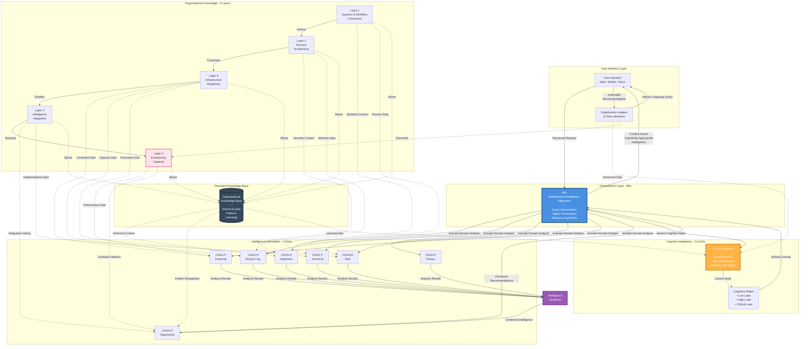

# Complete System Integration

## Overview
This diagram shows how all OAI³ components integrate into a unified organizational intelligence system - from user interaction through MIA, CAGAs, CLAGAs, the 5-layer framework, and back to actionable intelligence delivery.

## Diagram



## System Flow: Complete Journey

### Step 1: User Query → MIA
**What happens:**
- User submits query through interface (web, mobile, voice)
- UI translates to structured request
- MIA receives and interprets query

**Example:**
```
User: "Should we implement AI-powered ticket categorization?"
→ UI: Structured query object
→ MIA: Interprets intent, activates relevant agents
```

---

### Step 2: MIA → CAGAs Activation
**What happens:**
- MIA determines which CAGAs are needed
- Activates appropriate domain specialists
- Provides organizational context to each

**For this query, MIA activates:**
- ✅ CAGA-A (Does this align with goals?)
- ✅ CAGA-H (Do we have capacity?)
- ✅ CAGA-T (Is infrastructure ready?)
- ✅ CAGA-P (Any compliance issues?)
- ✅ CAGA-R (What are the risks?)
- ✅ CAGA-F (What's the ROI?)
- ⏳ CAGA-O (Waits for synthesis)

---

### Step 3: CAGAs → OAI³ Layers
**What happens:**
- Each CAGA pulls context from relevant OAI³ layers
- Historical data accessed from Knowledge Base
- Domain-specific analysis performed

**Example data flows:**
```
CAGA-T needs:
← Layer 1: Current workflow maps, tool inventory
← Layer 3: Technical infrastructure assessment
← KB: Past implementation patterns

CAGA-H needs:
← Layer 2: Decision authority, team structure
← Layer 3: Current capacity assessment
← KB: Historical workload data

CAGA-F needs:
← Layer 3: Budget constraints
← Layer 4: Past implementation costs
← KB: ROI patterns from similar projects
```

---

### Step 4: CAGAs → Intelligence Synthesis
**What happens:**
- Each CAGA completes domain analysis
- Results flow to Synthesis Engine
- Multi-dimensional intelligence combined

**Synthesis receives:**
```
CAGA-A: Strategic Value = 85/100
CAGA-H: Capacity = Constrained (60%)
CAGA-T: Feasibility = 70/100
CAGA-P: Compliance = Medium risk (needs review)
CAGA-R: Risk = Medium (containable)
CAGA-F: ROI = 4.5 month payback
```

---

### Step 5: Synthesis → CAGA-O
**What happens:**
- Synthesized intelligence flows to CAGA-O
- CAGA-O performs multi-factor ranking
- Prioritization and sequencing determined

**CAGA-O Output:**
```
Composite Score: 78/100
Priority Ranking: #3 of 12 opportunities
Recommended Sequence: Q2 (after CRM upgrade)
Tradeoffs identified and explained
```

---

### Step 6: Parallel Path - CLAGAs Assess Cognitive State
**What happens:**
- While CAGAs analyze, CLAGAs assess user state
- Interaction patterns monitored
- Cognitive load level detected

**For this interaction:**
```
CLAGA Detection:
- Time: Monday 9:00 AM (low-stress time)
- Pace: Slow, exploratory queries
- Pattern: Asking "how" and "why" questions
→ State: LOW LOAD (detailed analysis mode)
```

---

### Step 7: MIA Combines Intelligence + Cognitive State
**What happens:**
- CAGA-O recommendations received
- CLAGA state assessment received
- MIA determines appropriate delivery format

**Decision:**
```
Intelligence: Comprehensive analysis available
Cognitive State: LOW LOAD (user wants detail)
→ Delivery: DETAILED MODE
```

---

### Step 8: Response Delivery
**What happens:**
- MIA formats response based on cognitive state
- Full context-aware intelligence delivered
- User receives actionable recommendation

**Response to User (Detailed Mode):**
```
┌──────────────────────────────────────────────┐
│ AI-Powered Ticket Categorization             │
│ Recommendation: IMPLEMENT (Priority #3)     │
├──────────────────────────────────────────────┤
│                                              │
│ Strategic Alignment: 85/100 ⭐              │
│ → Supports customer experience goals        │
│ → Aligns with data-driven culture          │
│                                              │
│ Human Capacity: 60/100 ⚠                    │
│ → Team at 85% utilization                  │
│ → Requires 2-week training                 │
│                                              │
│ Technical Feasibility: 70/100 ✓            │
│ → CRM integration available                │
│ → 6-8 week timeline                        │
│                                              │
│ [View Full Analysis] [Risk Assessment]      │
│ [Implementation Roadmap] [Compare Options]  │
└──────────────────────────────────────────────┘
```

---

### Step 9: Continuous Learning Loop
**What happens:**
- User interaction stored in Knowledge Base
- Outcome tracked over time
- System learns and improves

**Feedback captured:**
```
User approved recommendation → Positive signal
Implementation began Q2 → Timeline data
Actual ROI: 4.2 months → Update CAGA-F model
Team adoption: 85% → Update CAGA-H patterns
```

---

### Step 10: Evolution Detection (Layer 5)
**What happens:**
- Layer 5 monitors system health
- Detects organizational changes
- Triggers adaptation when needed

**Example evolution trigger:**
```
3 months later:
- Company expands to new product category
- Ticket categorization accuracy drops 15%
→ Layer 5 detects drift
→ Alerts user: "Model needs retraining"
→ Recommends: Update categorization with new data
```

---

## Key Integration Points

### Integration Point 1: MIA ↔ CAGAs
**Purpose:** Coordinate multi-dimensional analysis

**How it works:**
- MIA activates CAGAs based on query type
- Passes organizational context to each
- Receives domain-specific analysis back
- Ensures all relevant factors considered

**Critical Design:**
- CAGAs operate independently (no cross-influence during analysis)
- MIA synthesizes after independent analysis complete
- Prevents groupthink, ensures diverse perspectives

---

### Integration Point 2: MIA ↔ CLAGAs
**Purpose:** Adapt delivery to human cognitive capacity

**How it works:**
- MIA requests cognitive state assessment
- CLAGAs analyze user interaction patterns
- State classification returned (Low/High/Critical)
- MIA formats response accordingly

**Critical Design:**
- CLAGA assessment runs in parallel with CAGA analysis
- Does not block intelligence generation
- Can adjust mid-session if state changes

---

### Integration Point 3: CAGAs ↔ OAI³ Layers
**Purpose:** Ground analysis in organizational reality

**How it works:**
- Each CAGA pulls context from relevant layers
- Layer 1-2 provide current state data
- Layer 3 provides constraint data
- Layer 4-5 provide historical/evolution data

**Critical Design:**
- CAGAs access only necessary layer data (not all layers)
- Permissions enforced (sensitive data protected)
- Real-time + historical context combined

---

### Integration Point 4: All Components ↔ Knowledge Base
**Purpose:** Enable learning and continuous improvement

**How it works:**
- All layers store data in Knowledge Base
- All agents access historical patterns
- Outcomes tracked for model improvement
- Cross-organizational patterns recognized

**Critical Design:**
- Graph database for complex relationships
- Vector embeddings for semantic search
- Time-series for evolution tracking
- Privacy controls for sensitive data

---

### Integration Point 5: Layer 5 ↔ All Layers
**Purpose:** Detect drift and trigger evolution

**How it works:**
- Layer 5 monitors all other layers
- Compares current state to baseline
- Detects changes that require adaptation
- Triggers refresh of affected layers

**Critical Design:**
- Passive monitoring (doesn't block operations)
- Proactive alerts (before breakdown)
- Feedback loop to Layer 1 (restart cycle)

---

## Data Flow Examples

### Example 1: Simple Query (Low Complexity)
```
Query: "What's our readiness score for AI adoption?"

Flow:
User → UI → MIA
MIA → CLAGA (assess state) → LOW LOAD detected
MIA → Layer 3 only (readiness data)
Layer 3 → MIA (readiness score: 65/100)
MIA → UI → User

Time: <500ms
CAGAs activated: None (simple data retrieval)
```

---

### Example 2: Strategic Decision (High Complexity)
```
Query: "Should we pivot to enterprise customers?"

Flow:
User → UI → MIA
MIA → All 7 CAGAs activated
CAGAs → Access Layers 1-5 + KB
Each CAGA → Domain analysis
All CAGAs → Synthesis Engine
Synthesis → CAGA-O (ranking)
CAGA-O → MIA
MIA → CLAGA (assess state) → HIGH LOAD detected
MIA → Format as SIMPLIFIED
MIA → UI → User

Time: 2-5 seconds
CAGAs activated: All 7
Data accessed: Full organizational context
```

---

### Example 3: Emergency Response (Critical Complexity)
```
Query: "Customer onboarding is broken NOW!"

Flow:
User → UI → MIA
MIA → CLAGA (assess state) → CRITICAL LOAD
MIA → CAGA-R only (risk analysis)
CAGA-R → Layer 1 (workflow dependencies)
CAGA-R → Quick risk assessment
MIA → Format as EMERGENCY MODE
MIA → UI → User: "Pause onboarding. Alert customers."

Time: <1 second
CAGAs activated: 1 (CAGA-R only)
Detail deferred: Full analysis available after crisis
```

---

## System Properties

### 1. Context-Aware
Every response is grounded in:
- Current organizational state (Layers 1-2)
- Organizational constraints (Layer 3)
- Implementation history (Layer 4)
- Evolution patterns (Layer 5)
- Cross-organizational patterns (KB)

**Result:** No generic recommendations. Everything is specific to this organization.

---

### 2. Multi-Dimensional
Every analysis considers:
- Strategic alignment (CAGA-A)
- Human impact (CAGA-H)
- Technical feasibility (CAGA-T)
- Compliance (CAGA-P)
- Risk (CAGA-R)
- Financial (CAGA-F)
- Synthesis (CAGA-O)

**Result:** No single-factor thinking. All relevant dimensions considered.

---

### 3. Cognitively Adaptive
Every delivery is adapted to:
- Current cognitive load (CLAGA detection)
- User preferences (learned over time)
- Situational context (time, urgency)

**Result:** Right information, right format, right time.

---

### 4. Continuously Learning
Every interaction improves:
- CAGA models (better domain analysis)
- CLAGA models (better load detection)
- Knowledge Base (richer patterns)
- Layer 5 (better evolution detection)

**Result:** System gets smarter over time.

---

### 5. Evolutionarily Stable
System adapts when:
- Organization changes (detected by Layer 5)
- Workflows evolve (updated in Layer 1)
- New constraints emerge (updated in Layer 3)
- Performance degrades (caught by monitoring)

**Result:** Intelligence doesn't degrade; it evolves.

---

## Technical Architecture Notes

### Technology Stack
```
Frontend:
- Web: React (responsive UI)
- Mobile: React Native
- Voice: Natural language processing

Backend:
- API Layer: Node.js / FastAPI
- MIA Orchestration: Python (LLM-based)
- CAGA Engines: Python (ML + rule-based)
- CLAGA Engine: Python (real-time detection)

Data:
- Knowledge Base: Neo4j (graph) + PostgreSQL (relational)
- Vector Store: Pinecone / Weaviate
- Cache: Redis
- Queue: RabbitMQ / Kafka

Infrastructure:
- Cloud: AWS / GCP
- Containers: Docker + Kubernetes
- Monitoring: Prometheus + Grafana
```

### Performance Targets
- Simple queries: <500ms response
- Complex analysis: <5s response
- Emergency mode: <1s response
- CLAGA detection: <50ms
- System uptime: 99.9%

### Scalability Design
- Horizontal scaling for CAGAs (parallel execution)
- Async processing for complex queries
- Caching for frequent analyses
- Load balancing across MIA instances

---

## File Information
- **Created:** December 2025
- **Version:** 2.0
- **Part of:** OAI³ Framework Architecture Documentation
- **Related Diagrams:**
  - MIA Orchestration Flow
  - CAGA Network Architecture
  - CLAGA Adaptation Flow
  - OAI³ Implementation Stack
  - CosentriQ Platform Architecture