# CosentriQ Platform Architecture

## Overview
This diagram shows how the OAI³ framework is implemented as CosentriQ - the first organizational intelligence platform for non-technical SMEs.

## Diagram

```mermaid
graph TB
    subgraph "User-Facing Product Tiers"
        Foundation[CosentriQ Foundation<br/>$249/month<br/>---<br/>• Workflow Mapping<br/>• AI Opportunities<br/>• Implementation Guides<br/>• Monthly Monitoring]
        
        Plus[CosentriQ Plus<br/>$499-799/month<br/>---<br/>• Everything in Foundation<br/>• Scenario Intelligence<br/>• Decision Modeling<br/>• Bi-weekly Monitoring]
        
        Enterprise[CosentriQ Enterprise<br/>$999-1,499/month<br/>---<br/>• Everything in Plus<br/>• SAM Architecture<br/>• Custom System Design<br/>• Weekly Monitoring]
    end
    
    subgraph "Product Modules (CosentriQ Core)"
        M1[Module 1<br/>Infrastructure Mapping<br/>---<br/>Discover & Map<br/>Workflow Documentation<br/>Tool Inventory]
        
        M2[Module 2<br/>Readiness Engine<br/>---<br/>Capacity Assessment<br/>Constraint Identification<br/>Feasibility Scoring]
        
        M3[Module 3<br/>AI Architecture Studio<br/>---<br/>Use Case Portfolio<br/>Integration Design<br/>Priority Ranking]
        
        M4[Module 4<br/>Implementation Planner<br/>---<br/>Step-by-Step Guides<br/>Role Mapping<br/>Timeline Tracking]
        
        M5[Module 5<br/>Intelligence Signal Center<br/>---<br/>Health Monitoring<br/>Drift Detection<br/>Evolution Planning]
    end
    
    Foundation --> M1
    Foundation --> M2
    Foundation --> M3
    Foundation --> M4
    Foundation --> M5
    
    subgraph "Premium Modules"
        M6[Module 6<br/>Scenario Intelligence<br/>---<br/>What-If Modeling<br/>Pivot Analysis<br/>Risk Propagation]
        
        M7[Module 7<br/>SAM Architecture<br/>---<br/>3D System Modeling<br/>Custom AI Design<br/>Enterprise Blueprints]
    end
    
    Plus --> M6
    Enterprise --> M7
    
    subgraph "Intelligence Engine (OAI³)"
        MIA_Engine[MIA Engine<br/>Orchestration]
        CAGA_Network[CAGA Network<br/>7 Domain Agents]
        CLAGA_Engine[CLAGA Engine<br/>Cognitive Adaptation]
        
        MIA_Engine --> CAGA_Network
        MIA_Engine --> CLAGA_Engine
    end
    
    M1 -.->|Powered by| MIA_Engine
    M2 -.->|Powered by| CAGA_Network
    M3 -.->|Powered by| CAGA_Network
    M4 -.->|Powered by| CAGA_Network
    M5 -.->|Powered by| CAGA_Network
    M6 -.->|Powered by| MIA_Engine
    M7 -.->|Powered by| CAGA_Network
    
    subgraph "Data & Knowledge Layer"
        OrgKB[(Organizational<br/>Knowledge Base)]
        
        Layer1[Layer 1 Data<br/>Workflows, Tools]
        Layer2[Layer 2 Data<br/>Decisions, Authority]
        Layer3[Layer 3 Data<br/>Readiness, Constraints]
        Layer4[Layer 4 Data<br/>Implementations]
        Layer5[Layer 5 Data<br/>Evolution, Performance]
        
        Layer1 --> OrgKB
        Layer2 --> OrgKB
        Layer3 --> OrgKB
        Layer4 --> OrgKB
        Layer5 --> OrgKB
    end
    
    M1 -->|Populates| Layer1
    M2 -->|Populates| Layer3
    M3 -->|Populates| Layer4
    M4 -->|Populates| Layer4
    M5 -->|Monitors| Layer5
    
    CAGA_Network -.->|Accesses| OrgKB
    
    subgraph "Add-On Services"
        Diagnostic[M-OAI³ Diagnostic<br/>$997-1,497 one-time<br/>---<br/>24-48hr Assessment<br/>Roadmap Generation<br/>Platform Entry Point]
        
        GeniusBar[Genius Bar Support<br/>$399-499/month<br/>---<br/>1:1 Expert Sessions<br/>Configuration Help<br/>Implementation Guidance]
        
        ImplServices[Implementation Services<br/>$7,500-12,500<br/>---<br/>Hands-On Deployment<br/>Team Training<br/>Change Management]
    end
    
    Diagnostic -.->|Converts to| Foundation
    Diagnostic -.->|Converts to| Plus
    
    Foundation -.->|Optional Add| GeniusBar
    Plus -.->|Optional Add| GeniusBar
    Enterprise -.->|Optional Add| GeniusBar
    
    Foundation -.->|Can Purchase| ImplServices
    Plus -.->|Can Purchase| ImplServices
    Enterprise -.->|Can Purchase| ImplServices
    
    subgraph "Customer Journey"
        Awareness[Awareness<br/>Content, Referrals]
        Consideration[Consideration<br/>M-OAI³ Diagnostic]
        Adoption[Adoption<br/>Foundation Tier]
        Expansion[Expansion<br/>Plus/Enterprise]
        Advocacy[Advocacy<br/>Referrals, Case Studies]
    end
    
    Awareness --> Consideration
    Consideration --> Diagnostic
    Diagnostic --> Adoption
    Adoption --> Expansion
    Expansion --> Advocacy
    Advocacy -.->|Generates| Awareness
    
    style Foundation fill:#E8F5E9,stroke:#4CAF50,stroke-width:2px
    style Plus fill:#E3F2FD,stroke:#2196F3,stroke-width:2px
    style Enterprise fill:#F3E5F5,stroke:#9C27B0,stroke-width:2px
    style MIA_Engine fill:#4A90E2,stroke:#2E5C8A,stroke-width:3px,color:#fff
    style CAGA_Network fill:#50C878,stroke:#2E7D4E,stroke-width:3px,color:#fff
    style CLAGA_Engine fill:#FFB347,stroke:#CC7A00,stroke-width:3px,color:#fff
    style OrgKB fill:#34495E,stroke:#1C2833,stroke-width:3px,color:#fff
```



## Product Architecture Breakdown

### Core Product Tiers

#### CosentriQ Foundation - $249/month
**Target Customer:** 10-50 employee organizations, first-time AI adopters

**What's Included:**
1. **Infrastructure Mapping (Module 1)**
   - Unlimited workflow documentation
   - Tool inventory and integration mapping
   - Current state visualization

2. **Readiness Engine (Module 2)**
   - Capacity assessment
   - Constraint identification
   - Feasibility scoring

3. **AI Architecture Studio (Module 3) - Basic**
   - AI opportunity identification
   - Basic prioritization
   - Tool recommendations (off-the-shelf)

4. **Implementation Planner (Module 4)**
   - Step-by-step implementation guides
   - Role and responsibility mapping
   - Timeline tracking

5. **Intelligence Signal Center (Module 5) - Monthly**
   - Monthly health check-ins
   - Basic drift detection
   - Evolution recommendations

**Powered By:**
- MIA Engine (basic mode)
- 7 CAGAs (standard depth analysis)
- CLAGAs (adaptive delivery)

**Value Delivered:**
- Clear organizational map
- Prioritized AI opportunities
- Implementation roadmap
- ROI tracking
- Monthly evolution guidance

**Typical Use Case:**
```
Company: 30-person marketing agency
Pain: Using 12 different AI tools, unclear ROI
Solution: Foundation tier maps workflows, identifies 3 high-value AI opportunities, guides implementation
Outcome: Consolidates to 5 tools, $2K/month savings, 30% efficiency gain
```

---

#### CosentriQ Plus - $499-799/month
**Target Customer:** 50-150 employee organizations, scaling businesses

**Everything in Foundation, PLUS:**

6. **Scenario Intelligence (Module 6)**
   - What-if modeling for strategic decisions
   - Pivot impact analysis
   - Multi-scenario comparison
   - Risk propagation visualization

7. **AI Architecture Studio (Module 3) - Advanced**
   - Strategic alignment modeling
   - Multi-dimensional scenario comparison
   - Advanced sequencing logic

8. **Intelligence Signal Center (Module 5) - Bi-weekly**
   - Bi-weekly monitoring and alerts
   - Proactive drift detection
   - Advanced evolution planning

**Additional Capabilities:**
- Unlimited workflow optimizations (vs 5 in Foundation)
- Decision intelligence pathways
- Architecture-aware implementation sequencing
- Slack/Teams integration for ambient access

**Powered By:**
- MIA Engine (advanced mode)
- 7 CAGAs (deep analysis across all domains)
- CLAGAs (personalized adaptation)
- Scenario simulation engine

**Value Delivered:**
- Strategic decision modeling
- Pivot and expansion planning
- Proactive intelligence
- Deeper organizational integration

**Typical Use Case:**
```
Company: 80-person SaaS startup considering enterprise pivot
Pain: Unclear if pivot will succeed, high stakes decision
Solution: Plus tier models pivot scenarios, shows capacity impact, sequences changes
Outcome: Confident pivot decision, phased execution plan, 60% faster scaling
```

---

#### CosentriQ Enterprise - $999-1,499/month
**Target Customer:** 150-500 employee organizations, complex/regulated industries

**Everything in Plus, PLUS:**

9. **SAM - Scenario Architecture Modeling (Module 7)**
   - 3D organizational system modeling
   - Custom AI system design
   - Enterprise architecture blueprints
   - Technical documentation for engineering teams
   - Compliance pathway mapping

10. **Intelligence Signal Center (Module 5) - Weekly**
    - Weekly monitoring and intelligence reports
    - Priority alert system
    - Real-time drift detection

**Additional Capabilities:**
- Multi-team workflow coordination
- Custom integration architecture design
- ADRs (Architecture Decision Records)
- Scalability modeling for 500+ employees
- Dedicated success support

**Powered By:**
- MIA Engine (enterprise mode)
- 7 CAGAs (comprehensive analysis + custom models)
- CLAGAs (team-aware adaptation)
- SAM visualization and modeling engine

**Value Delivered:**
- Custom AI system design
- Enterprise-grade architecture
- Compliance-ready documentation
- Engineering handoff specifications
- Strategic scalability planning

**Typical Use Case:**
```
Company: 200-person HealthTech company, HIPAA-compliant
Pain: Need custom AI for patient data, can't use off-the-shelf tools
Solution: Enterprise tier designs compliant AI architecture, creates technical specs
Outcome: Engineering team builds proprietary system with CosentriQ blueprint, passes compliance audit
```

---

### Module-Level Detail

#### Module 1: Infrastructure Mapping (Discover & Map)
**Corresponds to:** OAI³ Layer 1 (Systems & Workflow Coherence)

**What It Does:**
- Guided interview flows to capture workflows
- Automated workflow diagram generation
- Tool inventory with integration status
- Decision point identification
- Bottleneck and inefficiency detection

**User Experience:**
```
User: "Map our customer onboarding workflow"
→ MIA: Asks structured questions about the process
→ User: Describes workflow in natural language
→ MIA: Generates visual workflow map
→ User: Reviews, refines, approves
→ System: Saves to Layer 1 organizational knowledge
```

**Powered By:**
- CAGA-T (technical system understanding)
- CAGA-R (identifies workflow risks)
- MIA (conversational mapping)

**Outputs:**
- Workflow maps (visual + data)
- Tool inventory
- Integration dependency graph
- Coherence Score

---

#### Module 2: Readiness Engine
**Corresponds to:** OAI³ Layer 3 (Infrastructure Readiness)

**What It Does:**
- Assesses technical infrastructure capacity
- Evaluates human capacity and skill gaps
- Analyzes budget and resource constraints
- Maps risk tolerance and compliance requirements

**User Experience:**
```
User: "Are we ready to implement AI for customer support?"
→ MIA: Activates readiness assessment
→ CAGAs: Analyze capacity, budget, skills, compliance
→ System: Generates readiness score + constraints
→ User: Sees clear "go/no-go" with prerequisites
```

**Powered By:**
- CAGA-H (human capacity)
- CAGA-T (technical infrastructure)
- CAGA-F (financial capacity)
- CAGA-P (compliance readiness)

**Outputs:**
- Readiness Score (0-100)
- Constraint Map
- Prerequisite Checklist
- Gap Analysis

---

#### Module 3: AI Architecture Studio
**Corresponds to:** OAI³ Layer 4 (Intelligence Integration Logic)

**What It Does:**
- Identifies AI opportunities specific to this organization
- Ranks opportunities by multi-factor scoring
- Designs integration patterns
- Sequences implementation for maximum coherence

**User Experience:**
```
User: "Show me our top AI opportunities"
→ CAGAs: Analyze workflows, goals, constraints
→ CAGA-O: Ranks all opportunities
→ System: Presents prioritized portfolio
→ User: Selects opportunities to pursue
→ System: Generates implementation roadmap
```

**Powered By:**
- All 7 CAGAs (comprehensive analysis)
- CAGA-O (opportunity ranking and synthesis)

**Outputs:**
- AI Use Case Portfolio
- Priority Rankings
- Integration Blueprint
- Sequenced Roadmap

**Foundation vs Plus:**
- **Foundation:** Off-the-shelf tool recommendations
- **Plus:** Custom integration design, strategic alignment modeling

---

#### Module 4: Implementation Planner
**Corresponds to:** OAI³ Layer 4 (Implementation Guidance)

**What It Does:**
- Converts architecture into actionable steps
- Maps roles and responsibilities
- Provides configuration templates
- Tracks milestones and progress

**User Experience:**
```
User: "We approved AI ticket categorization, what's next?"
→ System: Generates implementation checklist
→ User: Sees who does what, when
→ System: Provides setup guides and templates
→ User: Executes step-by-step
→ System: Tracks completion
```

**Powered By:**
- CAGA-R (risk mitigation during implementation)
- CAGA-F (cost tracking)
- MIA (step-by-step guidance)

**Outputs:**
- Implementation Checklist
- Execution Path (who/what/when)
- Setup Snapshots (templates)
- Progress Tracking

---

#### Module 5: Intelligence Signal Center
**Corresponds to:** OAI³ Layer 5 (Evolutionary Capacity)

**What It Does:**
- Monitors organizational intelligence health
- Detects workflow drift and degradation
- Tracks ROI vs expectations
- Recommends evolution before breakdown

**User Experience:**
```
[3 months after implementation]
→ System: Detects accuracy drop in AI categorization
→ Alert: "Ticket categorization accuracy down 15%"
→ Analysis: "New product category not in training data"
→ Recommendation: "Retrain model with recent tickets"
→ User: Takes action before customer impact
```

**Powered By:**
- All 7 CAGAs (continuous monitoring)
- Layer 5 drift detection

**Outputs:**
- OAI³ Health Dashboard
- Evolution Score
- Alert System
- Adaptation Recommendations

**Monitoring Frequency:**
- **Foundation:** Monthly check-ins
- **Plus:** Bi-weekly monitoring
- **Enterprise:** Weekly monitoring + priority alerts

---

#### Module 6: Scenario Intelligence (Plus/Enterprise Only)
**Purpose:** Model strategic decisions before committing

**What It Does:**
- Simulates "what if" scenarios
- Models pivot impacts across organization
- Shows resource allocation consequences
- Visualizes risk propagation

**User Experience:**
```
User: "What happens if we pivot to enterprise customers?"
→ System: Simulates scenario across all dimensions
→ Output: Shows impact on:
   - Team capacity (will need 3 new hires)
   - Technical infrastructure (CRM upgrade required)
   - Financial (18-month break-even vs 12-month current)
   - Risk (customer concentration risk increases)
→ User: Compares scenarios, makes informed decision
```

**Powered By:**
- MIA (scenario orchestration)
- All CAGAs (multi-dimensional impact modeling)
- Simulation engine

**Outputs:**
- Scenario Comparison Reports
- Impact Projections
- Risk-Adjusted Recommendations
- Resource Requirements

---

#### Module 7: SAM - Scenario Architecture Modeling (Enterprise Only)
**Purpose:** Design custom AI systems for complex organizations

**What It Does:**
- 3D visualization of organizational systems
- Custom AI architecture design
- Technical specification generation
- Compliance pathway documentation

**User Experience:**
```
User: "We need a HIPAA-compliant AI system for patient triage"
→ System: Designs custom architecture
→ Output:
   - 3D system model (data flows, integrations)
   - Technical specifications for engineering
   - Compliance documentation
   - ADRs (Architecture Decision Records)
→ User: Hands to engineering team for build
```

**Powered By:**
- CAGA-T (technical architecture design)
- CAGA-P (compliance validation)
- CAGA-R (system risk modeling)
- SAM visualization engine

**Outputs:**
- 3D System Models
- Technical Specifications
- Integration Diagrams
- Compliance Documentation
- Engineering Handoff Docs

---

### Add-On Services

#### M-OAI³ Diagnostic - $997-1,497 (One-Time)
**Purpose:** Pre-purchase assessment + platform entry point

**What's Included:**
- 24-48 hour comprehensive assessment
- Workflow and decision architecture mapping
- AI opportunity identification
- Readiness scoring
- Implementation roadmap

**Customer Journey:**
1. Purchase diagnostic
2. Complete assessment (24-48 hours)
3. Receive comprehensive report + roadmap
4. Convert to Foundation/Plus tier (60-70% conversion rate)
5. Use diagnostic roadmap to guide first 90 days

**Value:**
- De-risks platform commitment
- Immediate actionable insights
- Clear path to subscription

---

#### Genius Bar Support - $399-499/month
**Purpose:** On-demand expert guidance

**What's Included:**
- 2-4 scheduled sessions per month
- Configuration and troubleshooting help
- Implementation guidance
- Best practice coaching

**Best For:**
- Complex implementations
- Teams with limited technical capacity
- Organizations wanting expert validation

---

#### Implementation Services
**Tier C (Standard):** $7,500
- 1-3 workflows
- Hands-on implementation
- Team training
- 30-day support

**Tier P (Complex):** $12,500
- Cross-functional systems
- Regulated industries
- Custom integration work
- 60-day support

---

### Customer Journey Through CosentriQ

#### Stage 1: Awareness
**How they find us:**
- Content marketing (OAI³ thought leadership)
- Accelerator partnerships (Camelback, Google for Startups)
- Referrals from existing customers
- Speaking engagements

**What they learn:**
- AI adoption requires organizational intelligence
- Generic tools fragment, don't integrate
- CosentriQ provides infrastructure, not just tools

---

#### Stage 2: Consideration
**Decision point:** "Should we try CosentriQ?"

**Path:** Purchase M-OAI³ Diagnostic ($997-1,497)

**What they get:**
- Complete organizational assessment
- AI opportunity roadmap
- Readiness validation
- Clear next steps

**Conversion:** 60-70% convert to subscription

---

#### Stage 3: Adoption
**Decision point:** "Which tier?"

**Typical Path:**
- 70% start with Foundation ($249/month)
- 25% start with Plus ($499-799/month)
- 5% start with Enterprise ($999-1,499/month)

**First 90 Days:**
- Month 1: Map workflows and assess readiness
- Month 2: Identify top 3-5 AI opportunities
- Month 3: Begin first implementation

**Success Metrics:**
- First recommendation: <1 hour
- Implementation start: <7 days
- Measurable ROI: 30-60 days

---

#### Stage 4: Expansion
**Upgrade Triggers:**

**Foundation → Plus:**
- "We need scenario modeling for strategic decisions"
- "We want more than 5 active optimizations"
- "Bi-weekly monitoring would help"

**Plus → Enterprise:**
- "We need custom AI system design"
- "Compliance requires extensive documentation"
- "We're building proprietary infrastructure"

**Expansion Rate:** 40% upgrade tiers annually

---

#### Stage 5: Advocacy
**Customer becomes promoter:**
- Refers other companies
- Provides case studies
- Speaks at events
- Joins customer advisory board

**Referral Value:**
- Average 2-3 referrals per satisfied customer
- 40% referral conversion rate
- Lower CAC than other channels

---

## Technical Architecture

### Frontend
- **Web App:** React (responsive, mobile-optimized)
- **Mobile Apps:** React Native (iOS, Android)
- **Voice Interface:** Natural language processing

### Backend
- **API Layer:** Node.js / FastAPI
- **MIA Engine:** Python (LLM orchestration)
- **CAGA Modules:** Python (ML + rule-based)
- **CLAGA Engine:** Python (real-time detection)
- **SAM Engine:** Python (3D modeling, visualization)

### Data Layer
- **Primary DB:** PostgreSQL (relational data)
- **Graph DB:** Neo4j (organizational structure)
- **Vector Store:** Pinecone (semantic search)
- **Cache:** Redis
- **Message Queue:** RabbitMQ

### Infrastructure
- **Cloud:** AWS (primary) / GCP (backup)
- **Containers:** Docker + Kubernetes
- **CI/CD:** GitHub Actions
- **Monitoring:** Prometheus + Grafana
- **Logging:** ELK Stack

---

## Business Model

### Revenue Streams
1. **Subscription Revenue** (Primary)
   - Foundation: $249/month
   - Plus: $499-799/month
   - Enterprise: $999-1,499/month

2. **Diagnostic Revenue** (Acquisition)
   - M-OAI³: $997-1,497 one-time

3. **Add-On Revenue** (Expansion)
   - Genius Bar: $399-499/month
   - Implementation Services: $7,500-12,500

### Unit Economics
- CAC: $3,000-5,000 (SME), $15,000-25,000 (Enterprise)
- LTV: $50,000+ (SME), $500,000+ (Enterprise)
- LTV/CAC: 10:1+
- Gross Margin: 85%+

### Growth Strategy
- **Year 1:** 100 customers, $30K MRR
- **Year 2:** 500 customers, $150K MRR
- **Year 3:** 2,000 customers, $600K MRR
- **Year 4:** 5,000 customers, $1.5M MRR
- **Year 5:** 10,000 customers, $3M+ MRR

---

## File Information
- **Created:** December 2025
- **Version:** 2.0
- **Part of:** OAI³ Framework Architecture Documentation
- **Related Diagrams:**
  - MIA Orchestration Flow
  - CAGA Network Architecture
  - CLAGA Adaptation Flow
  - OAI³ Implementation Stack
  - Complete System Integration